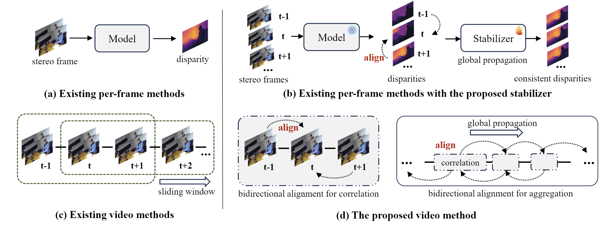

# Match-Stereo-Videos via Bidirectional Alignment

**[Imperial College London](https://www.imperial.ac.uk/)**

[Junpeng Jing](https://tomtomtommi.github.io), 
[Ye Mao](https://yebulabula.github.io/), 
[Anlan Qiu](), 
[Krystian Mikolajczyk](https://www.imperial.ac.uk/people/k.mikolajczyk)

[[`Paper`](https://arxiv.org/abs/2409.20283)] [[`Project`](https://tomtomtommi.github.io/BiDAVideo/)]



## What's new?
An update of the previous project [`BiDAStereo`](https://tomtomtommi.github.io/BiDAStereo/), for stereo videos:

&#9745; Support BiDAStabilizer for image-based network, RAFTStereo and IGEVStereo, for video stereo matching.

&#9745; Support added [video datasets](https://github.com/TomTomTommi/bidavideo/tree/main/datasets): KITTI Depth, Infinigen SV, Southkensington SV.

&#9745; Support new metrics and losses.

&#9745; Support demo code for arbitrary stereo video as input.


## Installation

Installation with PyTorch3D, PyTorch 1.12.1 & cuda 11.3

### Setup the root for all source files:
```
git clone https://github.com/tomtomtommi/bidavideo
cd bidavideo
export PYTHONPATH=`(cd ../ && pwd)`:`pwd`:$PYTHONPATH
```
### Create a conda env:
```
conda create -n bidavideo python=3.8
conda activate bidavideo
```
### Install requirements
```
conda install pytorch==1.12.1 torchvision==0.13.1 torchaudio==0.12.1 cudatoolkit=11.3 -c pytorch
pip install "git+https://github.com/facebookresearch/pytorch3d.git@stable"
pip install -r requirements.txt
```

## Demo

Demo code can be run using the following script:
```
sh demo.sh
```
In this script, you can specify which model (RAFTStereo, IGEVStereo with/without BiDAStabilizer; BiDAStereo) you want to use for demo.

Before running, download the checkpoints on [google drive](https://drive.google.com/drive/folders/1eLcJXLf8qEF70WLKtNcGDHFwpgNTywN5?usp=drive_link). 
Copy the checkpoints to `./checkpoints/`

To test on your own data, modify `--path ./demo_video/`. More arguments can be found and modified in ` demo.py`

## Dataset

Download the following datasets and put in `./data/datasets`:
 - [SceneFlow](https://lmb.informatik.uni-freiburg.de/resources/datasets/SceneFlowDatasets.en.html)
 - [Sintel](http://sintel.is.tue.mpg.de/stereo)
 - [Dynamic_Replica](https://dynamic-stereo.github.io/)
 - [KITTI Depth](https://www.cvlibs.net/datasets/kitti/eval_depth_all.php)
 - [Infinigen SV](https://tomtomtommi.github.io/BiDAVideo/)
 - [SouthKensington SV](https://tomtomtommi.github.io/BiDAVideo/)

The folder stucture of the datasets should look like:
```none
/data/datasets/
            ├── Driving
            ├── FlyingThings3D
            ├── Monkaa
            ├── sintel_stereo
                ├── training
                    ├── camdata_left
                    ├── disparities
                    ├── ...
                    ├── clean_left
                    ├── clean_right
            ├── dynamic_replica_data
                ├── train
                ├── test
                ├── real
            ├── InfinigenStereo
                ├── train
                ├── test
                ├── val
            ├── SouthKensington
                ├── Indoor
                    ├── video001
                    ├── ...
                ├── Outdoor
                    ├── video001
                    ├── ...
            ├── kitti_depth
                ├── gt_depth
                    ├── 2011_09_26_drive_0001_sync
                    ├── 2011_09_26_drive_0002_sync
                    ├── ...
                    ├── 2011_10_03_drive_0047_sync
                ├── input
                │   ├── 2011_09_26
                │   ├── 2011_09_28
                │   ├── ...
                │   ├── 2011_10_03
```

## Evaluation
Download the checkpoints on [google drive](https://drive.google.com/drive/folders/1eLcJXLf8qEF70WLKtNcGDHFwpgNTywN5?usp=drive_link). 
Copy the checkpoints to `./checkpoints/`.

To evaluate BiDAStabilizer:
```
sh evaluate_bidastabilizer.sh
```

To evaluate BiDAStereo:
```
sh evaluate_bidastereo.sh
```

The results are evaluated on an A6000 48GB GPU.

## Training
To train BiDAStabilizer:
```
sh train_bidastabilizer.sh
```
`--restore_ckpt` is the fixed weights of image-based models. `--ckpt_path` is the logging path.

To train BiDAStereo:
```
sh train_bidastereo.sh
```
You can decrease `image_size` and / or `sample_len` if you don't have enough GPU memory.

## License 
The code is under MIT license.

SouthKensington SV dataset is licensed under Creative Commons Attribution-NonCommercial-ShareAlike 4.0 International ([CC BY-NC-SA 4.0](https://creativecommons.org/licenses/by-nc-sa/4.0/legalcode)). Under this license, if you want to modify SK-SV or generate new data from SK-SV dataset (e.g., super-resolution, denoising, defocus), the releasing of your new data should be licensed under the same CC BY-NC-SA 4.0. 

## Citation 
If you use BiDAStabilizer or BiDAStereo in your research, please use the following BibTeX entry.
```
@article{jing2024match,
  title={Match Stereo Videos via Bidirectional Alignment},
  author={Junpeng Jing and Ye Mao and Anlan Qiu and Krystian Mikolajczyk},
  year={2024}
}

@article{jing2024match-stereo-videos,
  title={Match-Stereo-Videos: Bidirectional Alignment for Consistent Dynamic Stereo Matching},
  author={Junpeng Jing and Ye Mao and Krystian Mikolajczyk},
  year={2024}
}
```
